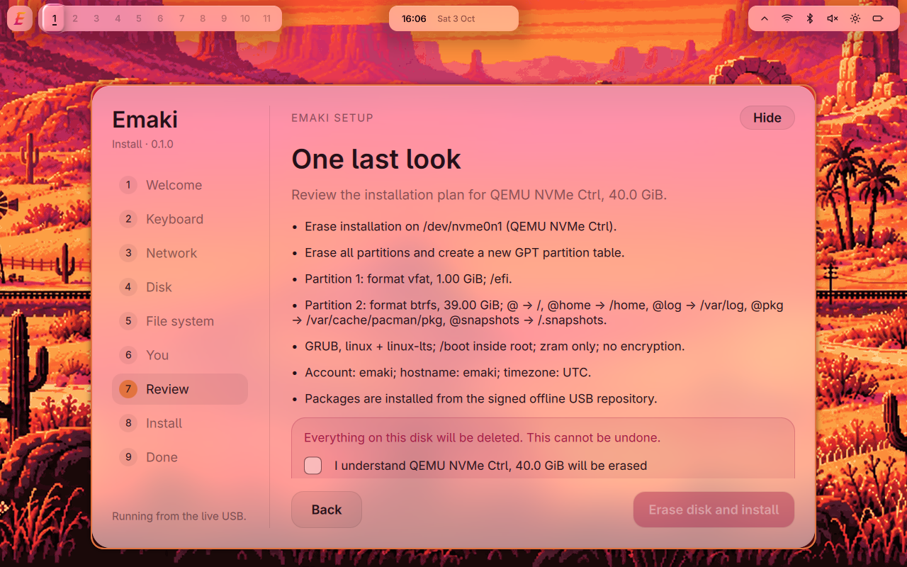
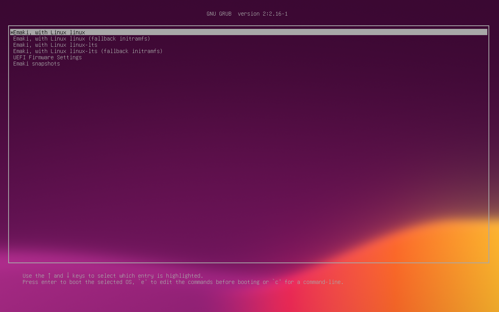
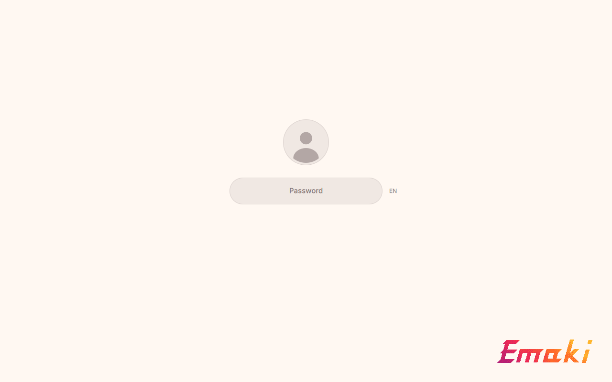

# Emaki

Emaki is an Arch-based desktop built around **niri-emaki**, a fork of the
[niri](https://github.com/niri-wm/niri) scrollable-tiling Wayland compositor, and its own
[Quickshell](https://quickshell.org) shell. Warm colours, glass panels, and a living
pixel-art wallpaper: a looping valley at sunset that scrolls with your workspaces, with
steam trains running through it.

**Status: 0.4.0 alpha — not for everyday use.** See [Release stages](#release-stages). It is
tested in QEMU with UEFI firmware (OVMF) and has been installed on one real machine so far, see
[Tested hardware](#tested-hardware).

| | |
|---|---|
|  |  |
| The live session from the USB stick | The installer, last step before writing to disk |
|  |  |
| GRUB: two kernels and the btrfs snapshots | The login screen |

## Release stages

- **0.x — alpha.** The rawest stage, for the people building Emaki. Things can break between
  updates and data can be lost. Do not install it on a computer you depend on; if you try it, use
  a spare machine and keep backups.
- **1.x — beta.** Ready for everyday use. Rough edges remain and updates keep fixing them; if
  something is wrong, report it in the issues.
- **2.0 and later — no label.**

Beta here is the stage of Emaki as a whole, not a pre-release: every new version reaches the
`testing` update channel first and `stable` after it passes the checks.

## What's inside

- **niri-emaki** (`packaging/niri-emaki/`) — niri 26.04 with eight patches: the living
  wallpaper, glass capture for the shell, a seamless handoff from the login screen, an
  animated overview backdrop, crisp cursors at fractional scale and a distinct exit status
  when no GPU renderer can be created, plus locked-session capture protection.
- **The shell** (`shell/`) — bar islands (workspaces, clock, system, privacy), dock,
  launcher, notifications and on-screen display on liquid glass. The login screen (a greetd
  greeter) and the lock screen are drawn by the same shell.
- **The `emaki` command** (`crates/`) — system map and state, and niri window/workspace
  commands from the terminal.
- **The installer** (`installer/`) — a root worker with a JSON protocol, a command-line client
  and a graphical window.
- **The ISO profile** (`iso/`) — archiso 91 releng with the Emaki overlay.
- **Packages** (`packaging/`) — `emaki`, `emaki-apps`, `emaki-config`, `emaki-desktop`,
  `emaki-installer`, `emaki-keyring`, `emaki-mirrorlist`, `emaki-nvidia`, `niri-emaki`, `quickshell-emaki`,
  `xdg-desktop-portal-gnome-emaki`.
- **Art** (`art/`, `cursors/`, `fetch/`, `boot/`) — the wallpaper, logo, cursors, GRUB
  background and boot splash, with the scripts that make them.

## The ISO

Download: https://dl.emaki.sh/iso/0.4.0/emaki-0.4.0-x86_64.iso (5.0 GB). Its checksum and
signature are at the same address with `.sha256` and `.sig` added; the key that signed it is
https://dl.emaki.sh/iso/0.4.0/emaki-signing-key.asc.

`emaki-0.4.0-x86_64.iso` boots into a live Emaki session with the installer open. Emaki
needs a computer with 64-bit UEFI; legacy BIOS computers are refused by the installer. If
Windows on the computer uses BitLocker or device encryption, save its recovery key first:
changing firmware security settings can make Windows ask for it.
Secure Boot must be switched off in the firmware settings before booting the stick.
The installer offers:

- **Erase disk** with **btrfs** (recommended: snapper snapshots that you can boot from the GRUB
  menu) or **ext4** (no system snapshots).
- **Manual partitioning**: prepare partitions in GParted, then assign mount points in the
  installer; an existing EFI system partition can be reused.
- **Offline installation** from the signed package repository on the USB stick. When the
  machine is online, the installer can also update Emaki at the end.

The installed system gets GRUB with `linux` and `linux-lts`, zram and NetworkManager. The
installer offers two software sets. **Minimal** is the desktop with Dolphin, Firefox and kitty.
**Rich** (preselected) adds LibreOffice, Thunderbird, Okular, Kate, Gwenview, Ark, Haruna,
Elisa, Spectacle, OBS Studio, qBittorrent, KeePassXC, Discover with Flatpak, Partition Manager,
Filelight, System Monitor, ISO Image Writer, KCharSelect, Skanlite, printing and
media codecs. Not in 0.4.0: BIOS boot, installing alongside Windows.

## Security notes

Ordinary apps running in your account outside a sandbox, including non-Flatpak apps,
can capture your screen and send key presses or pointer input without asking
(wlr-screencopy, virtual-keyboard, wlr-virtual-pointer).
niri blocks direct access to these protocols for clients it recognises as sandboxed,
such as Flatpak apps using a sandbox connection (security-context-v1).

If the lock-screen program crashes, the desktop stays locked, but niri accepts another
program as the replacement locker (ext-session-lock-v1).
A malicious program already running in your account could take over and unlock the
session without your password.

## Tested hardware

| Machine | Emaki | Works | Known issues |
|---|---|---|---|
| MacBook Pro (Retina, 13-inch, Early 2015) | 0.1.1 | Live session from USB, installation (erase disk, btrfs), boot, login, desktop, Wi-Fi on 2.4 GHz, screen lock on lid close | 5 GHz Wi-Fi networks are not listed (Broadcom BCM43602); the GRUB menu text is very small on the Retina display |
| MacBook Pro (Retina, 13-inch, Early 2015) | 0.2.0 | Installation from USB with disk encryption, disk unlock in about 5 s, boot, desktop, updates from the Emaki mirror | The disk-password screen is drawn small in a corner of the Retina display; Wi-Fi joined in the installer has to be joined again after installing |
| MacBook Pro (Retina, 13-inch, Early 2015) | 0.3.0 | Update from 0.2.0 with `pacman -Syu`, screen lock after closing and opening the lid, installation from USB with disk encryption, wrong and right disk password, boot, login, desktop | After "Restart now" the "remove the USB stick" message is almost unreadable (dark text on a black box); shutting down the live session reports "Failed to start Generate shutdown ramfs"; the disk-password screen does not yet match the boot menu |
| MacBook Pro (Retina, 13-inch, Early 2015) | 0.3.1 | Update from 0.3.0 with `pacman -Syu`, boot with disk encryption, login, desktop, wrong and right password on the lock screen | After hibernation the session does not respond; Wi-Fi joined in the installer has to be joined again after installing |
| MacBook Pro (Retina, 13-inch, Early 2015) | 0.4.0 | Installation from USB with disk encryption, boot, login, desktop, Wi-Fi on 2.4 GHz, keyboard control of the panel and dock | Wi-Fi joined in the installer has to be joined again after installing |

Installed Emaki on another machine? Reports are welcome in the issues.

### Known issues in 0.4.0

- Hibernation: on the tested MacBook the session does not respond after resuming. Do not use
  hibernation.
- Wi-Fi joined in the installer has to be joined again after installing.
- Systems updated from earlier versions print `warning: directory permissions differ on
  /etc/sudoers.d/` during updates. Administrator rights keep working.
- Machines that still update from the old GitHub address print
  "emaki: missing required signature" once after moving to `pkgs.emaki.sh`; the next update is
  clean.

## Updates

An installed system updates with `pacman -Syu`. Emaki's own packages come from the signed
`[emaki]` repository at `pkgs.emaki.sh`: `emaki-keyring` installs the signing key and
`emaki-mirrorlist` selects the `stable` channel. Everything else comes from Arch.

## Building

- **Packages**: each one builds with `makepkg` in its directory under `packaging/`;
  `emaki-config` and `emaki-installer` archive the committed checkout, so commit first.
  Details and local checks: [`packaging/README.md`](packaging/README.md).
- **ISO**: `iso/build.sh` runs inside a disposable Arch build VM with archiso 91, from a signed
  repository of the packages above. The build and the QEMU/OVMF test cycle
  (`tests/vm/run-iso.sh` and the `tests/vm/iso-*` scripts) are described in
  [`docs/iso.md`](docs/iso.md); the installer in [`installer/README.md`](installer/README.md).
- **Checks**: `make check` (configs and fast tests), `python3 tests/test-packaging.py`,
  `PYTHONPATH=installer python -m unittest discover -s installer/tests`, `iso/check.sh`.

## License

GPL-3.0-or-later, see [LICENSE](LICENSE). Copyright (C) 2026 Artur Yakymenko.

Patches to other projects keep those projects' licences: the niri patches in
`packaging/niri-emaki/` are GPL-3.0-or-later like niri; the Quickshell patch in
`packaging/quickshell-emaki/` is LGPL-3.0-only like Quickshell.
